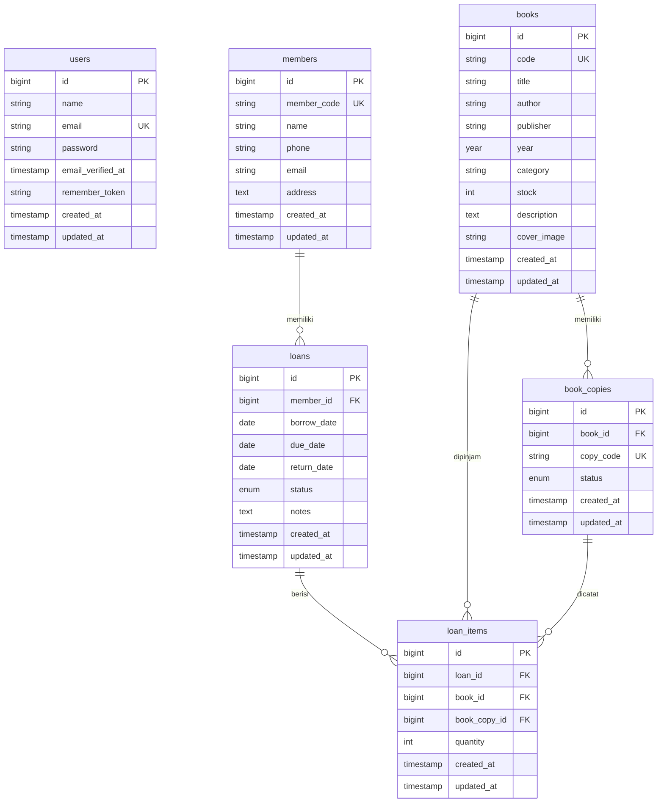

# ERD Sistem Informasi Perpustakaan

Dokumen ini menjelaskan struktur database utama pada project `perpustakaan`.

## Diagram ERD

## Fungsi Tiap Tabel

| Tabel | Fungsi |
|---|---|
| `users` | Menyimpan akun petugas untuk login ke sistem. |
| `members` | Menyimpan data anggota perpustakaan. |
| `books` | Menyimpan metadata buku seperti kode, judul, penulis, penerbit, tahun, stok, deskripsi, cover, dan `category` sebagai metadata opsional. |
| `book_copies` | Menyimpan eksemplar fisik dari buku. Satu judul buku bisa punya beberapa copy. |
| `loans` | Menyimpan transaksi peminjaman utama, termasuk anggota, tanggal pinjam, due date, tanggal kembali, dan status. |
| `loan_items` | Menyimpan detail buku/copy yang dipinjam pada satu transaksi peminjaman. |

## Primary Key

- `users.id`
- `members.id`
- `books.id`
- `book_copies.id`
- `loans.id`
- `loan_items.id`

## Foreign Key

- `book_copies.book_id` mengarah ke `books.id`.
- `loans.member_id` mengarah ke `members.id`.
- `loan_items.loan_id` mengarah ke `loans.id`.
- `loan_items.book_id` mengarah ke `books.id`.
- `loan_items.book_copy_id` mengarah ke `book_copies.id`.

## Relasi Antar Tabel

- Satu anggota dapat memiliki banyak transaksi peminjaman.
- Satu buku dapat memiliki banyak eksemplar atau copy.
- Satu transaksi peminjaman dapat memiliki banyak item peminjaman.
- Satu item peminjaman mencatat buku yang dipinjam dan copy fisik yang dipakai.

## Alasan Menggunakan `book_copies`

Tabel `books` menyimpan data judul buku, sedangkan `book_copies` menyimpan eksemplar fisik buku.

Contoh:

- Buku "Dasar Pemrograman" adalah satu data di tabel `books`.
- Jika perpustakaan punya 3 eksemplar, maka akan ada 3 data di tabel `book_copies`.
- Masing-masing copy punya `copy_code` dan `status`.

Dengan cara ini, sistem bisa tahu copy mana yang sedang tersedia, dipinjam, rusak, atau hilang.

Catatan: kolom `category` tetap ada di tabel `books`, tetapi pada tampilan final metadata yang lebih ditonjolkan adalah `publisher` atau penerbit. Kolom `category` dipertahankan sebagai metadata opsional, bukan fitur kategori utama.

## Hubungan `loans` dan `loan_items`

Tabel `loans` menyimpan data transaksi utama, seperti siapa anggota yang meminjam dan kapan tanggal pinjamnya.

Tabel `loan_items` menyimpan detail koleksi yang dipinjam pada transaksi tersebut.

Struktur ini membuat sistem lebih fleksibel, karena satu transaksi peminjaman bisa berisi lebih dari satu buku/copy.

## Cara Sistem Mencatat Copy yang Dipinjam

Saat petugas membuat peminjaman:

1. Petugas memilih anggota.
2. Petugas memilih copy buku yang statusnya `available`.
3. Sistem membuat data di tabel `loans`.
4. Sistem membuat data di tabel `loan_items` dengan `book_id` dan `book_copy_id`.
5. Status copy di tabel `book_copies` berubah menjadi `borrowed`.
6. Stok buku dihitung ulang dari jumlah copy yang masih `available`.

Saat pengembalian:

1. Sistem mengambil data `loan_items`.
2. Sistem mencari `book_copy_id` yang sebelumnya dipinjam.
3. Copy tersebut dikembalikan menjadi `available`.
4. Status loan berubah menjadi `returned`.
