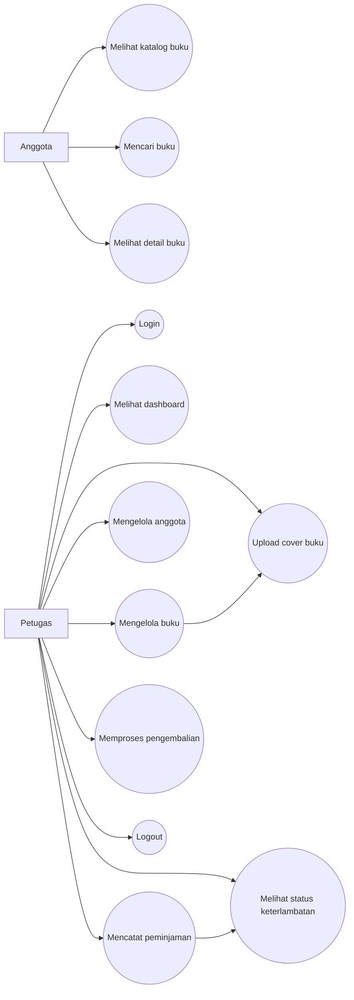

# Use Case Diagram

Dokumen ini menjelaskan aktor dan use case utama pada Sistem Informasi Perpustakaan.

## Diagram Use Case

## Aktor

| Aktor | Penjelasan |
|---|---|
| Anggota | Pengguna yang melihat katalog koleksi perpustakaan. Anggota tidak perlu login untuk melihat katalog dan detail buku. |
| Petugas | Pengguna yang login untuk menjalankan operasional perpustakaan seperti mengelola buku, anggota, peminjaman, dan pengembalian. |

## Use Case Anggota

| Use Case | Penjelasan |
|---|---|
| Melihat katalog buku | Anggota membuka halaman katalog publik untuk melihat daftar koleksi. |
| Mencari buku | Anggota mencari buku berdasarkan kode, judul, penulis, atau penerbit. |
| Melihat detail buku | Anggota melihat informasi detail buku, penerbit, stok tersedia, cover, dan deskripsi. |

## Use Case Petugas

| Use Case | Penjelasan |
|---|---|
| Login | Petugas masuk ke sistem menggunakan email dan password. |
| Melihat dashboard | Petugas melihat ringkasan jumlah buku, anggota, peminjaman aktif, selesai, stok kosong, dan peminjaman terlambat. |
| Mengelola buku | Petugas menambah, mengubah, melihat, dan menghapus data buku. |
| Upload cover buku | Petugas menambahkan cover saat membuat atau mengubah data buku. |
| Mengelola anggota | Petugas menambah, mengubah, mencari, dan menghapus data anggota. |
| Mencatat peminjaman | Petugas memilih anggota dan copy buku yang tersedia, lalu sistem membuat due date otomatis 7 hari. |
| Memproses pengembalian | Petugas mengubah peminjaman aktif menjadi dikembalikan. |
| Melihat status keterlambatan | Petugas melihat badge terlambat untuk peminjaman aktif dan badge terlambat dikembalikan untuk peminjaman yang sudah returned melewati due date. |
| Logout | Petugas keluar dari sistem. |

## Catatan Hak Akses

- Katalog dan detail buku bisa diakses tanpa login.
- Menu dashboard, buku, anggota, dan peminjaman hanya bisa diakses setelah petugas login.
- Anggota pada project ini adalah pengguna katalog publik, bukan akun login terpisah.
